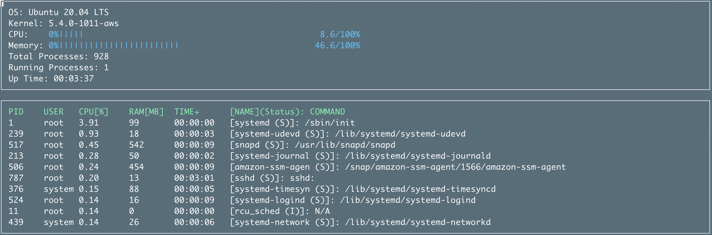

# CppND-System-Monitor


This project is based on the starter code for System Monitor Project in the Object Oriented Programming Course of the [Udacity C++ Nanodegree Program](https://www.udacity.com/course/c-plus-plus-nanodegree--nd213).



This project only targets Linux and is not ported to any other OS.

## Dependencies

- [ncurses](https://www.gnu.org/software/ncurses/) is a library that facilitates text-based graphical output in the terminal. This project relies on ncurses for display output.
- [Boost](https://www.boost.org) provides free peer-reviewed portable C++ source libraries.
- Build tools etc.

Install all the dependencies:
```bash
$ sudo apt-get update && apt-get install -y \
  tzdata \
  build-essential \ 
  cmake \
  clang-format \
  libncurses5-dev \
  libncursesw5-dev \
  libboost-all-dev
```
## Build the project

## Make
This project uses [Make](https://www.gnu.org/software/make/). The Makefile has four targets:
* `build` compiles the source code and generates an executable
* `format` applies [ClangFormat](https://clang.llvm.org/docs/ClangFormat.html) to style the source code
* `debug` compiles the source code and generates an executable, including debugging symbols
* `clean` deletes the `build/` directory, including all of the build artifacts

### Linux
1. Clone the project repository: `git clone https://github.com/psnx/CppND-System-Monitor.git`
2. Build the project: `make build`
3. Run the resulting executable: `./build/monitor`

### Docker
1. Spin up the container:
```bash
sudo docker-compose up -d
```
2. Check if the container is running
```bash
$ sudo docker ps
CONTAINER ID        IMAGE                       COMMAND             CREATED             STATUS              PORTS               NAMES
beabc1b6e3d9        cppnd-system-monitor_main   "/bin/bash"         3 seconds ago       Up 2 seconds                            cppnd-system-monitor_main_1
```

3. run interactive bash in the container
```bash
sudo docker exec -it beabc1b6e3d9 bash #as in your CONTAINER ID
```

4. build the project in the container
```bash
cd /srv
make build
./build/monitor # to check if it works
exit # leave the container
```
5. you will find the binary in the build folder
```
./build/monitor
```
